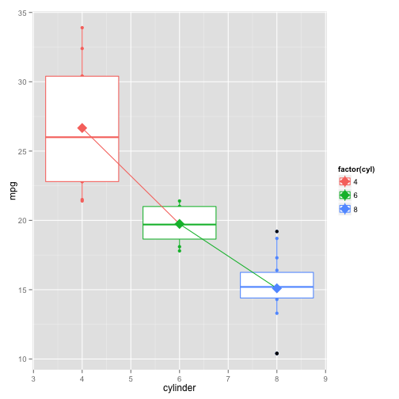

Shiny Demonstration
========================================================
author: Markus Heuchert
date: 2014-10-23
font-family: 'Helvetica'
transition: zoom
part of the Coursera Data Science Specialization


App overview
========================================================

This little app gives you an insight in the possibilities of the shiny package for R.
The app has three pages. Two of them are working on the **mtcars** data set. 

- Welcome Page (just for fun)
- Car data cylinder effects
- Car data cluster analysis & comparison


Car data cylinder effects
=======================================================
Click on cars to get to this part of the app. Here you can create reactive plots to visualize differences between cars with different number of cylinders. The power of the arithmetic operations of the ggplot2 package are demonstrated.


```r
plot <- ggplot(mtcars, aes(x = cyl, y = mpg, color = factor(cyl)))+geom_point()+xlab("cylinder")
plot <- plot + geom_boxplot()
plot <- plot + stat_summary(fun.y=mean, geom="line", aes(group =1))+stat_summary(fun.y=mean, geom="point", shape = 18, size = 6)
```

Car data cylinder effects 2
==============
As seen on the previous slide, the options are just added. This makes the code very handy. The full plot is shown here.

 

Car data clustering
=======
The second tabpanel gives you the option to perform a cluster analysis on the data and compare two models. 

- You can choose how the app calculates the difference
- You can compare two cars

The comparsion becomes interesting if you choose two cars that are in a cluster with a certain method, but totally different in a different one.
